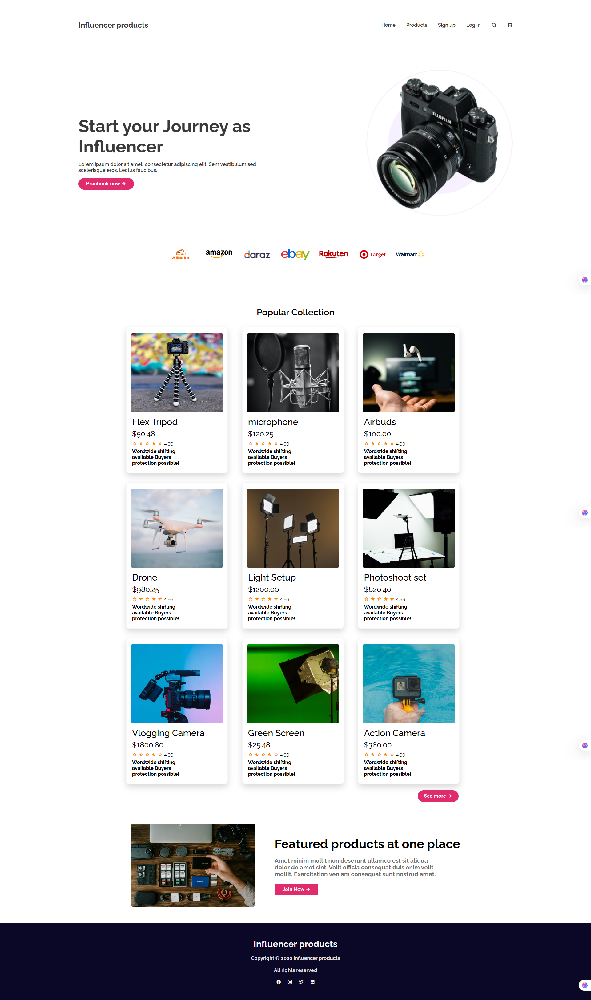
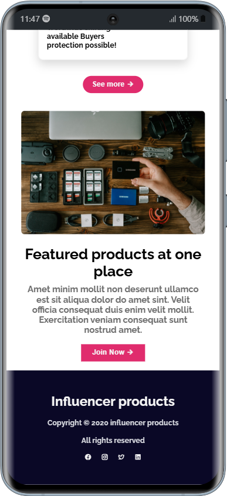

# Influencer Gear 🌟

A **responsive Influencer Gear website** crafted with **HTML & CSS**, showcasing modern layout techniques using **Flexbox** and **Media Queries** for seamless mobile and desktop experience. 📱💻

---

## 🌐 Live Demo
[View the live site here »](https://elias729.github.io/influencer-gear/)

---

## 📸 Screenshots

### 💻 Desktop View

---

### 📱 Mobile View

---

## 🚀 Features

- Fully responsive design for all device sizes  
- Clean, modern, and intuitive user interface  
- Built with Flexbox for flexible layouts  
- CSS Media Queries for mobile responsiveness  
- Lightweight and optimized for fast loading

---

## 🛠️ Technologies Used

- **HTML5**  
- **CSS3**  
- **Flexbox**
- **CSS Grid**  
- **CSS Media Queries**

---

## 👨‍💻 Author

**Elias Hossain Rafe**  
[GitHub](https://github.com/Elias729) | [LinkedIn](https://www.linkedin.com/in/elias-hossain-rafe)

---

*Feel free to reach out for feedback or collaborations!*

